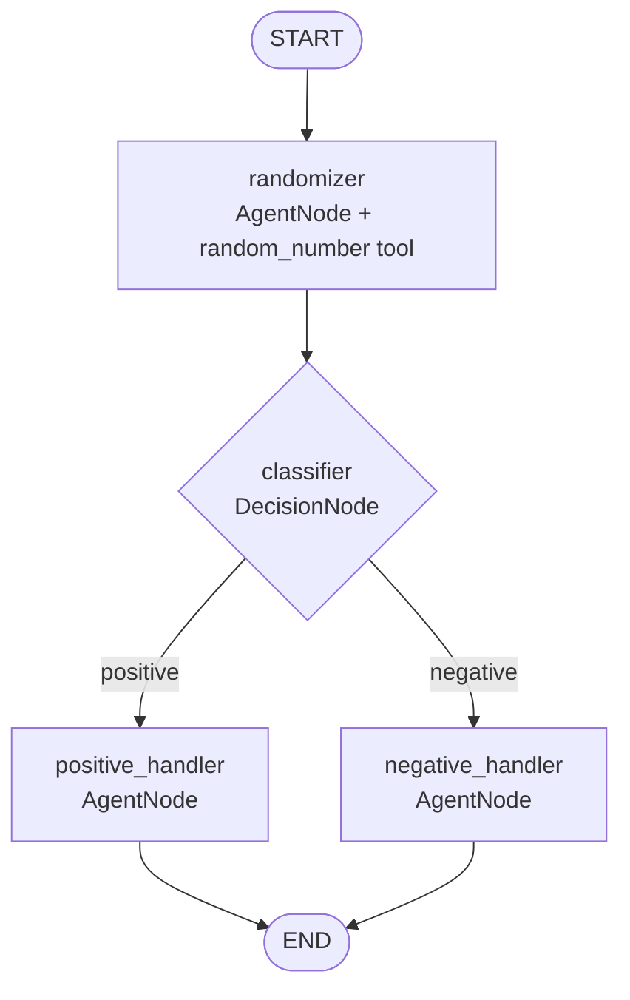

# Agentic Framework

**Build LLM agent graphs declaratively — wire nodes with a single `>` operator that compiles to a native LangGraph `StateGraph`.**


Wiring agent graphs in raw LangGraph is verbose, imperative boilerplate: `add_node`, `add_edge`, `add_conditional_edges`, route functions, structured-output plumbing. This framework replaces that with a declarative `>` DSL and a handful of well-chosen node abstractions — an automatic tool-call loop, structured-output routing, and resumable human-in-the-loop. It compiles to a plain LangGraph `StateGraph`, so checkpointing, streaming, and LangSmith tracing come for free.

```python
randomizer > classifier
classifier["positive"] > positive_handler
classifier["negative"] > negative_handler
```

That's the whole mental model: `>` builds the graph, and branches index by choice.

## The quickstart graph



The randomizer calls a Python tool, the classifier routes on the result via constrained structured output, and one of two handlers produces the final reply — all wired with `>` (full runnable source in [`examples/sample_usage.py`](examples/sample_usage.py)).

## Design decisions

The framework is small on purpose; the value is in a few load-bearing choices.

- **Deferred wiring, then compile-once.** `a > b` only sets `a.child = b` and returns `b`, so `a > b > c` builds a linked list in memory with no edges yet. `AgenticGraph(...)` walks the `.child` pointers once at construction, emits the real `add_node`/`add_edge` calls, and `compile()`s. The graph is frozen at build time — wiring bugs surface immediately, not mid-run. Revisited nodes are short-circuited by name, so cycles (research loops) just work; names must be unique.
- **Reducer-based state deltas.** Nodes return *only the keys they change* and never mutate state in place; LangGraph reducers (`add_messages`, `operator.add`) merge those deltas. This is what keeps checkpointing, parallel-branch merges, and subgraph composition correct rather than racy.
- **Routing constrained to a `Literal`.** `DecisionNode` wraps the LLM with `with_structured_output` over a Pydantic model whose field is `Literal[*choices]`, so the model can *only* return a valid branch name — no invalid-state routing bugs. The label lands in a dedicated `decision` field and never pollutes `messages`.
- **Compiles to plain LangGraph — no lock-in.** `AgenticGraph` *is* a `StateGraph` subclass. You get the whole LangGraph ecosystem (streaming, async, durability, LangSmith, checkpointers) underneath, and can drop down to it anytime.

## Install

Requires **Python ≥ 3.10**. Core deps: LangGraph ≥ 1.0, langchain-core ≥ 1.0, Pydantic 2.

```bash
python -m venv .venv && source .venv/bin/activate
pip install -e .                 # core
pip install -e ".[openai]"       # + langchain-openai & python-dotenv (example/notebook)
pip install -e ".[rag]"          # + langchain-chroma (ChromaRAG)
pip install -e ".[dev]"          # + pytest
```

For live model calls, copy `.env.example` to `.env` and set `OPENAI_API_KEY`.

## Quickstart

A tool call → decision → branch graph, wired entirely with `>`:

```python
import random
from langchain_openai import ChatOpenAI
from langchain_core.messages import HumanMessage

from agentic_framework.graph import AgenticGraph
from agentic_framework.nodes import AgentNode, DecisionNode
from agentic_framework.state import AgenticState


def random_number(maximum: int) -> int:
    """Return a random integer between 1 and `maximum` (inclusive)."""
    return random.randint(1, maximum)


llm = ChatOpenAI(model="gpt-5.4-nano")

# An agent that can call a tool. bind_tools wraps the bare function as a
# StructuredTool and runs the call/respond loop automatically.
randomizer = AgentNode(
    name="randomizer",
    llm=llm,
    node_prompt="Use the random_number tool to pick a number, then state it.",
)
randomizer.bind_tools([random_number])

# A decision node returns one of `choices` into the `decision` state field.
classifier = DecisionNode(
    name="classifier",
    llm=llm,
    node_prompt="If the number is greater than 5 answer 'positive', else 'negative'.",
    choices=["positive", "negative"],
)

positive_handler = AgentNode(name="positive_handler", llm=llm,
                             node_prompt="Report the number in an upbeat tone.")
negative_handler = AgentNode(name="negative_handler", llm=llm,
                             node_prompt="Report the number in a gloomy tone.")

# Wire it.
randomizer > classifier
classifier["positive"] > positive_handler
classifier["negative"] > negative_handler

graph = AgenticGraph(
    state=AgenticState,
    start_node=randomizer,
    end_nodes={positive_handler, negative_handler},
)

result = graph.invoke({
    "messages": [HumanMessage(content="Give me a random number up to 10.")],
    "log": [],
})
print("routed to :", result["decision"])
print("final reply:", result["messages"][-1].content)
for line in result["log"]:          # per-node + tool-call trace
    print("  -", line)
```

## Node types

All nodes are callables (`__call__(state) -> delta`) invoked by LangGraph with the shared state. They return **only the keys they update**; reducers merge them.

| Node | Purpose |
|------|---------|
| **`AgentNode`** | Prepends its `node_prompt` as a `SystemMessage`, calls the LLM, returns a delta. `bind_tools(...)` wraps bare callables as `StructuredTool`s and runs an internal tool-call loop (capped by `max_tool_iterations`, default 25), accumulating every message produced this turn into one delta. A non-default `output_field` writes the final response *content* to that key instead of `messages` (transform nodes). Optional `reasoning_effort` (`"low"`/`"medium"`/`"high"`) is passed per-call for gpt-5.x. |
| **`DecisionNode`** | Branching only. Reads from `input_field`, writes its choice to `decision`, routes via conditional edges. Wired by indexing a choice (`decision["x"] > handler`); `decision > x` is an error. |
| **`InputNode`** | Human-in-the-loop via LangGraph's `interrupt()`. Resumes when the graph is built with a `checkpointer` and invoked with a `thread_id`, via `Command(resume=value)`. |

All node types also accept `cache_ttl` (LangGraph `CachePolicy`) and `retry` (LangGraph `RetryPolicy`); `AgenticGraph` auto-provides an `InMemoryCache` when any node sets `cache_ttl`. An `AgenticGraph` can itself be embedded as a node in a larger graph (`graph_0 > graph_1`), and RAG helpers (`make_retriever_tool`, optional `ChromaRAG`) wrap any LangChain retriever as a bindable tool.

## State

`AgenticState` is a `TypedDict` of reduced channels:

- **`messages`** — `add_messages` reducer: appends, replaces by matching `id`, coerces bare strings to `HumanMessage`, and merges parallel branches.
- **`log`** — `operator.add`: every node appends a trace line (`"{name}:{content}"`, tool calls, decisions). Seed it with `[]` on invoke to capture the trace.
- **`decision`** — transient routing key written by `DecisionNode`, read by its `route()`.

Custom schemas just add more reduced channels (e.g. a `summary` field for an `output_field` transform node).

## Running it

```bash
python -m pytest tests/            # full suite, no API calls (a scripted FakeLLM stands in)
python examples/sample_usage.py    # live end-to-end demo (needs OPENAI_API_KEY)
```

The **33-test** suite covers state reducers, graph construction, routing, the tool-call loop, interrupt/resume, RAG tool wiring, streaming/async, configurable fields, and node caching/retry/`reasoning_effort`/`durability`.

## Limitations

Kept honest on purpose:

- **Async is graph-level only.** `ainvoke`/`astream` run the sync nodes in LangGraph's threadpool; true per-node async LLM calls aren't implemented (which is also why a per-node `timeout` isn't exposed — LangGraph only times out async nodes).
- **`reasoning_effort` is `AgentNode`-only** — it conflicts with `DecisionNode`'s structured output on current OpenAI models.
- **`ChromaRAG` is untested end-to-end** — only `make_retriever_tool` is covered (against a fake retriever); the live Chroma path needs real embeddings.

## Project layout

```
agentic_framework/
  graph.py            # AgenticGraph — walks `.child`, compiles to StateGraph
  node.py             # base Node + the `>` operator
  state.py            # AgenticState (reduced channels)
  nodes/              # AgentNode, DecisionNode, InputNode
  tools/              # RAG tool helpers (make_retriever_tool, ChromaRAG)
examples/sample_usage.py
tests/                # pytest suite (no live API calls)
docs/project.md       # living notes: setup, status, roadmap, rough edges
```

See [`docs/project.md`](docs/project.md) for setup, status, and roadmap.

## License

MIT — see [LICENSE](LICENSE).
