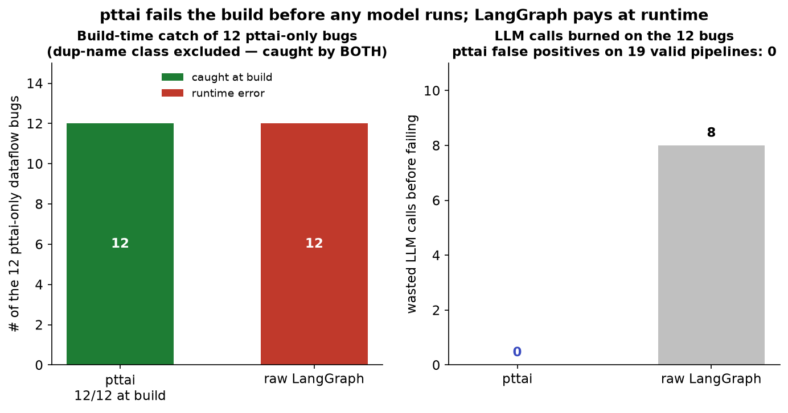
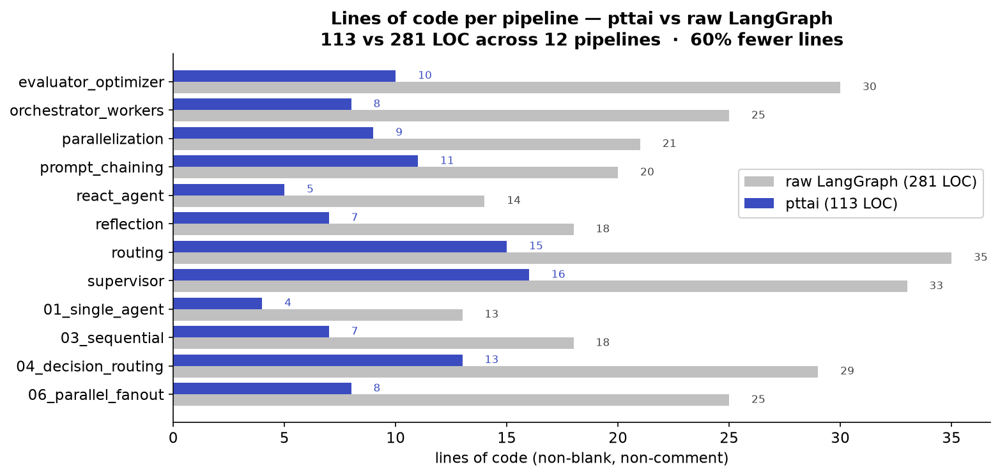

# pttai vs. raw LangGraph

pttai is a thin declarative layer over LangGraph. The headline is **not** the
`>` wiring syntax — it is that pttai **statically validates a graph's dataflow at
build time** and *fails the build* on a class of bugs that raw LangGraph happily
compiles and only surfaces at runtime (if at all). The line-count reduction is
real but secondary; the validator is the thing you cannot get from
`create_react_agent` or hand-wired `StateGraph` code.

## 1. The validator: bugs caught *before* invoke

Raw LangGraph's `compile()` does a structural check (are the edges/nodes wired
into a graph?) but does **no state-dataflow analysis**: it does not know that a
node reads a key no upstream node has written, that a routing branch dangles, or
that two parallel nodes clobber the same reducer-less key. Those become runtime
`KeyError` / `InvalidUpdateError` — or silent wrong behavior — on the unlucky
input that first exercises the path.

pttai runs a forward `may`/`must` dataflow fixpoint over the compiled edge list
in `AgenticGraph.validate()` and raises at construction. Every error below is
reproduced from the actual framework (see `pttai/validation.py`,
`pttai/graph.py`); the messages are verbatim.

### a. Read-before-write of a state key

```python
write = AgentNode(name="write", llm=get_llm(),
                  node_prompt="use {plan}", reads=["plan"], writes=["messages"])
planner = AgentNode(name="planner", llm=get_llm(),
                    node_prompt="plan", reads=["messages"], writes={"plan": str})
write > planner                       # the producer of `plan` runs LAST
AgenticGraph(start_node=write, end_nodes={planner})
```

**pttai raises `GraphValidationError`:**

```
[error] write: reads computed key 'plan' but no upstream node produces it before
this node (produced by: ['planner'], none of which are upstream); available keys
here: ['decision', 'log', 'messages', 'token']
```

Raw LangGraph: compiles fine; `state["plan"]` is a `KeyError` at runtime on the
first invoke.

### b. Dangling decision branch (a choice with no `.child`)

```python
d = DecisionNode(name="d", llm=get_llm(), node_prompt="pick", choices=["a", "b"])
h = AgentNode(name="h", llm=get_llm(), node_prompt="handle")
d["a"] > h                            # choice "b" is never wired
AgenticGraph(start_node=d, end_nodes={h})
```

**pttai raises `GraphValidationError`:**

```
[error] d: choice 'b' has no connected node; wire it, e.g. `decision['b'] > some_node`
```

Raw LangGraph: if your `add_conditional_edges` path map omits `"b"`, the model
returning `"b"` dead-ends at runtime — a bug that hides until that branch is hit.

### c. A non-end node whose `.child` is `None` (pttai DSL strictness — NOT a LangGraph bug)

```python
a = AgentNode(name="a", llm=get_llm(), node_prompt="one")
b = AgentNode(name="b", llm=get_llm(), node_prompt="two")
a > b                                 # forgot to declare b as an end node
AgenticGraph(start_node=a, end_nodes=set())
```

**pttai raises `ValueError` at build:**

```
Node 'b' has no children and is not an end node.
```

**This is not a LangGraph defect.** In raw LangGraph a node with no outgoing edge
is a *legal implicit terminal*: the graph compiles and runs to a normal halt
(verified empirically on LangGraph 1.2.x — `compile()` does not raise and
`invoke()` returns without error). pttai rejects it only because its DSL
*requires* every terminal to be declared in `end_nodes`. It is a useful
guardrail, but it is **pttai DSL strictness, not a bug LangGraph misses** — so it
is *excluded* from the differentiator numbers below.

### d. Duplicate node names — caught by BOTH frameworks (not a differentiator)

```python
a = AgentNode(name="dup", llm=get_llm(), node_prompt="one")
b = AgentNode(name="dup", llm=get_llm(), node_prompt="two")
a > b
AgenticGraph(start_node=a, end_nodes={b})
```

**pttai raises `ValueError` at build:**

```
Duplicate node name 'dup': two distinct nodes share this name. Node names must be
unique within a graph.
```

Raw LangGraph **also catches this at build**: `add_node("dup", ...)` a second
time raises `ValueError('Node `dup` already present.')`. So this class is *not* a
pttai-only advantage — both frameworks reject it at construction. pttai's message
is friendlier, but the guarantee is the same. (This was previously described here
as a silent overwrite; that was wrong for LangGraph 1.0 — corrected after
measuring it in `eval/bugbench/`.)

> There are more genuine pttai-only-at-build catches (the cyclic / loop-carried
> read-before-write case; concurrent writes to a reducer-less key across parallel
> branches; a `node_prompt` placeholder with no matching scalar read) — all in
> `pttai/validation.py::collect_issues`, and all measured in `eval/bugbench/`. Of
> the four classes above, **two (a, b) are caught only by pttai at build** while
> raw LangGraph surfaces them at runtime after wasting model calls; the dead-end
> (c) is pttai DSL strictness, not a LangGraph bug (legal implicit terminal); and
> duplicate names (d) is caught by both.

Measured over the full `eval/bugbench/` corpus (17 buggy + 19 valid pipelines),
pttai catches **12/12** pttai-only dataflow bugs at build with **0** false
positives; raw LangGraph catches **0** of those at build (all 12 surface at
runtime) after burning **8** model calls — a **simulated, worst-case-ordered**
figure from the offline fake LLM, not measured real-model cost (see
[`eval/bugbench/README.md`](../eval/bugbench/README.md)). The `dead-end-node`
class is *excluded* from these numbers because it is legal LangGraph behavior, not
a defect:

<p align="center">
  
</p>

<p align="center"><em>Regenerate from the committed data with <code>python figures/make_charts.py</code>.</em></p>

## 2. Lines of code, three architectures

Same workflow, both ways, from the runnable side-by-side files in
`examples/architectures/`. Each file has a `pttai_version()` and a
`langgraph_version()` with identical behavior. LOC = **non-blank, non-comment
source lines in the function body** (this includes the one in-function `import`
line and the single trailing demo `invoke`/`return` on *both* sides, so the
boilerplate cancels and the delta is clean). Counted programmatically via `ast`,
not by hand.

| Architecture      | Example file                                   | pttai LOC | raw LangGraph LOC | reduction |
|-------------------|------------------------------------------------|:---------:|:-----------------:|:---------:|
| ReAct tool loop   | `examples/architectures/react_agent.py`        |     5     |        14         |   ~64%    |
| Prompt chaining   | `examples/architectures/prompt_chaining.py`    |    11     |        20         |   ~45%    |
| Routing (gather→route) | `examples/architectures/routing.py`      |    15     |        35         |   ~57%    |

Across all 12 measured pipelines (`eval/loc_results.csv`) the totals are **113
vs 281 LOC — ~60% fewer lines**:

<p align="center">
  
</p>

### Cognitive-complexity notes (not just line count)

- **ReAct tool loop** — pttai: one `AgentNode(tools=[...])` *is* the loop. Raw
  LangGraph: you must know the `ToolNode` + `tools_condition` prebuilts, add the
  conditional edge, and remember the `tools → model` loop-back edge. The concept
  count, not just the LOC, is what trips people up.
- **Prompt chaining** — pttai: `extract > gate` then `gate["pass"] > expand >
  finalize` reads like the diagram. Raw LangGraph: a `step(prompt)` node factory,
  four `add_node`s, and manually wired `add_edge` / `add_conditional_edges` for
  the gate.
- **Routing (gather-then-route)** — the widest gap, and the most instructive: a
  tool-gathering phase *and* a structured-output routing phase can't share one
  raw-LangGraph node, so the hand-written version needs a separate `gather` node,
  a `ToolNode`, a synthetic `__route__` pass-through node, and two sets of
  conditional edges. pttai folds both phases into one `DecisionNode(tools=...)`.

## 3. Why not `create_react_agent`?

`create_react_agent` collapses exactly *one* pattern (the ReAct loop) into one
call — and for that single pattern the LOC gap above is smallest. It gives you
nothing for prompt chaining, routing, evaluator-optimizer, orchestrator-workers,
or any multi-node topology, and it does **no** build-time dataflow validation of
a custom state schema. pttai keeps the one-node-per-loop ergonomics *and*
generalizes to arbitrary topologies *and* validates the dataflow — while
compiling down to a plain LangGraph `StateGraph`, so streaming, async,
checkpointers, and LangSmith all still work underneath.
