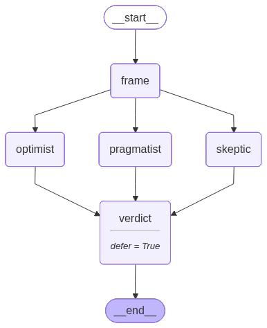

# nae

nae is a small declarative layer over
[LangGraph](https://langchain-ai.github.io/langgraph/) for building LLM agent
graphs. You create nodes — each a self-contained, tool-using agent — wire them
with the `>` operator, and hand the result to `AgenticGraph`, which compiles it
to a native LangGraph `StateGraph`.

nae builds on LangGraph, it doesn't replace it. The execution underneath is
plain LangGraph — streaming, async, checkpointers, and LangSmith work
unchanged, and you can drop down to raw LangGraph at any point (no lock-in).
What nae adds: the `>` wiring, nodes with a built-in tool-call loop, and a
build-time validator that catches dataflow bugs before you spend a token.

## The same agent, both ways

Here is one tool-using agent — an LLM that calls `add` / `multiply` in a loop
until it has the answer — written twice. Both versions print **126**; the
difference is the graph plumbing: **3 lines vs. 10**.

Shared setup for both versions — the model and the two tools:

```python
from langchain_openai import ChatOpenAI

llm = ChatOpenAI(model="gpt-5.4-nano")
# swap for any LangChain chat model, e.g.:
#   from langchain_anthropic import ChatAnthropic;              llm = ChatAnthropic(model="claude-opus-4-8")
#   from langchain_google_genai import ChatGoogleGenerativeAI;  llm = ChatGoogleGenerativeAI(model="gemini-...")

def add(a: int, b: int) -> int:
    """Add two numbers."""
    return a + b

def multiply(a: int, b: int) -> int:
    """Multiply two numbers."""
    return a * b
```

```python
# nae
from nae import AgentNode, AgenticGraph

agent = AgentNode(llm=llm, tools=[add, multiply])   # name inferred from the variable -> "agent"
graph = AgenticGraph(start_node=agent, end_nodes={agent})   # schema-free

graph.invoke(message="What is 21 + 21, then times 3?")      # -> 126
```

```python
# raw LangGraph
from langgraph.graph import StateGraph, MessagesState, START, END
from langgraph.prebuilt import ToolNode, tools_condition

llm_with_tools = llm.bind_tools([add, multiply])

def call_model(state: MessagesState):
    return {"messages": [llm_with_tools.invoke(state["messages"])]}

builder = StateGraph(MessagesState)
builder.add_node("call_model", call_model)
builder.add_node("tools", ToolNode([add, multiply]))
builder.add_edge(START, "call_model")
builder.add_conditional_edges("call_model", tools_condition)  # tools? -> "tools" : END
builder.add_edge("tools", "call_model")                       # loop back to the model
graph = builder.compile()

graph.invoke({"messages": [{"role": "user", "content": "What is 21 + 21, then times 3?"}]})  # -> 126
```

Same tools, same loop, same answer. nae folds the model node, the `ToolNode`,
the `tools_condition` edge, and the loop-back edge into one `AgentNode`, and
infers the state schema for you. Both versions run side by side in
[`examples/vs_langgraph.py`](https://github.com/TeeratP/nae/blob/main/examples/vs_langgraph.py).

## See your graph

Every `AgenticGraph` renders itself: in a notebook, make the graph the last
expression of a cell — or call `display(graph)` — and you get the compiled DAG.

```python
from IPython.display import display
display(graph)    # or make `graph` the last expression of the cell
```



This one is the multi-agent panel from the [Quickstart](quickstart.md):
`frame > fanout(optimist, skeptic, pragmatist) > verdict`. The
[full notebook tour](https://github.com/TeeratP/nae/blob/main/example.ipynb)
walks through rendering, validation, and every node type in one place, and
`python demo/app.py` opens a local
[Gradio playground](https://github.com/TeeratP/nae/blob/main/demo/) — paste a
`>`-DSL snippet, see the diagram and validator output, no API key needed.

How does `>` become a graph? `a > b` records a link; `AgenticGraph(...)` walks
the links once, emits the real LangGraph edges, validates, and compiles — see
[Under the hood](coming-from-langgraph.md#under-the-hood).

## Where to go next

- **[Quickstart](quickstart.md)** — install, a hello agent, a parallel panel,
  and the validator catching a real bug.
- **[Node types](node-types.md)** — the four node types, a runnable snippet each.
- **[The validator](validator.md)** — every dataflow bug class, with verbatim errors.
- **[State & observability](state.md)** — state channels, free token accounting,
  the trace log.
- **[Examples](examples.md)** — 21 runnable files: primitives one per file, plus
  end-to-end architectures.
- **[Coming from LangGraph](coming-from-langgraph.md)** — a direct API mapping.
